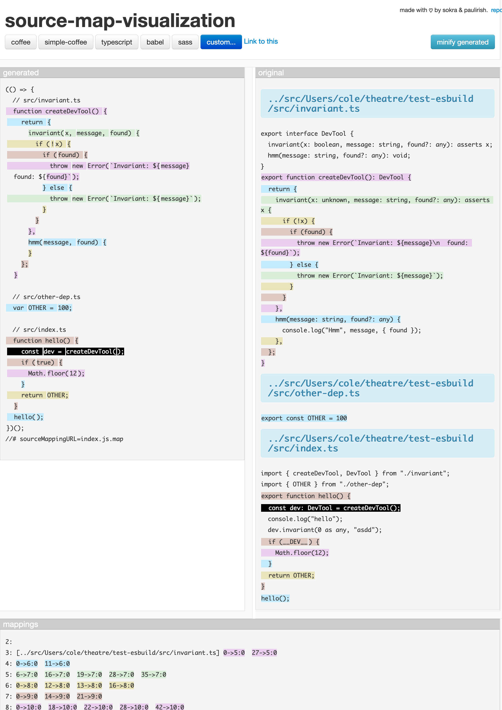

Demonstrating the viability of using a Rust CLI to replace source code for esbuild.

### Use cases:
 * Remove `console.log`s from final build output
 * Replace `__DEV__`s with `process.env.NODE_ENV !== 'production'`s
 * Any weird one off fixes necessary for a TypeScript file before loading

### Approach advantages:
 * Very fast / little overhead
 * Maintains original source maps by passing sourcemap into esbuild `onLoad` result
 * Simple enough to maintain in-house
 * Technically, we can easily access Tree-Sitter for pre-parsing before replacements
    * e.g. replace comments in styled css blocks

## Example

## Resources

 * https://github.com/jaredpalmer/tsdx#development-only-expressions--treeshaking
 * https://esbuild.github.io/plugins/#on-load-arguments
 * https://sokra.github.io/source-map-visualization/#custom
